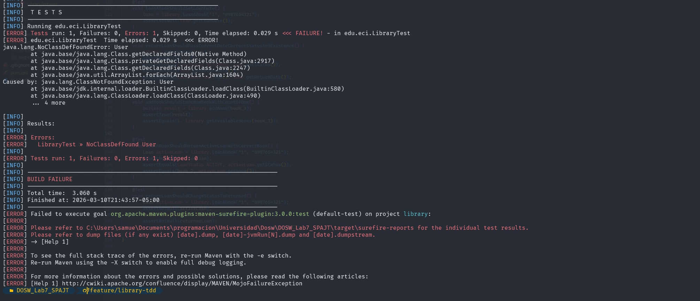

# Laboratorio 6

- Smuel Felipe Castelblanco Tellez
- Tomas Olaya Diaz
- Angela Gomez Valencia
- Paula Lozano Castaneda
- Juan Diego Patino Munoz

### Punto 4.2

- Se evidencia que, al ejecutar los tests, estos fallan, ya que no se han implementado los metodos.

### Punto 4.3

- Una vez ya implementados los metodos. Podemos evidenciar que los tests ya pasan

