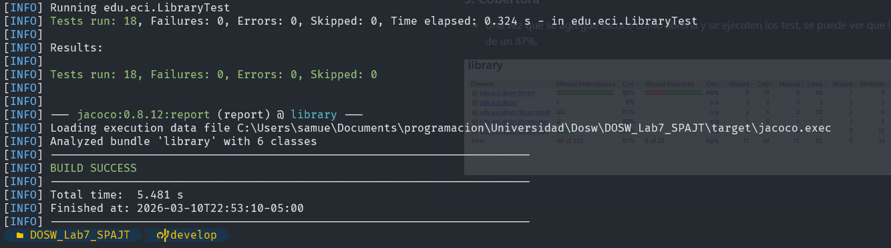
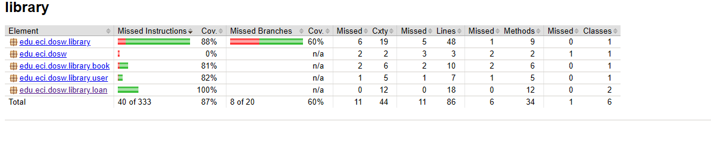
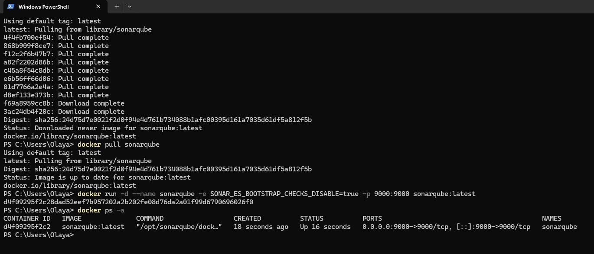
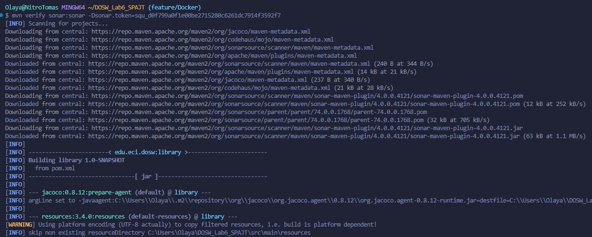
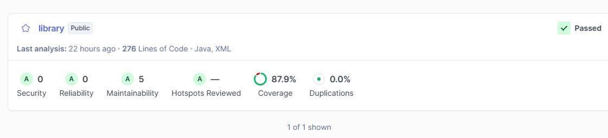

# Laboratorio 6

- Smuel Felipe Castelblanco Tellez
- Tomas Olaya Diaz
- Angela Gomez Valencia
- Paula Lozano Castaneda
- Juan Diego Patino Munoz

### Punto 4.2

- Se evidencia que, al ejecutar los tests, estos fallan, ya que no se han implementado los metodos.

### Punto 4.3

- Una vez ya implementados los metodos. Podemos evidenciar que los tests ya pasan

### 5: Cobertura

- Una vez que se agregue Jacoco como librería y se ejecuten los test, se puede ver que la cobertura que tenemos es de un 87%.

### 6: Docker, JaCoCo y SonarQube

- Las herramientas fueron usadas porque nos permiten analizar la calidad del código, medir la cobertura de pruebas y detectar posibles problemasd de mantenibilidad e incluso de confiabilidad.

#### Instalación de SonarQube usando Docker

- Para ejecutar SonarQube se usa Docker, lo cual nos permitio levantar el sistema de manera rápida y sin necesidad de instalar manualmente sus dependencias. Se descargo la imágen de SonarQube como se nos indicaba con el comando "docker pull sonarqube" y luego ejecutamos "docker run -d --name sonarqube -e SONAR_ES_BOOTSTRAP_CHECKS_DISABLE=true -p 9000:9000 sonarqube:latest" y por último verificamos con el comando "docker ps -a".

#### Acceso a SonarQube

- Una vez iniciado el contenedor, se accedio a SonarQube desde el navegador "http://localhost:9000" y para iniciar el usuario y la contraseña son "admin", luego tenemos que generar un token. Luego medimos la cobertura con JaCoCo el cual se implemento en el pom, después de configurar el plugin de maven usamos el comando "mvn clean verify" el cual nos ayuda a limpiar compilaciones anteriores, compila el código y ejecuta todas las pruebas unitarias, además nos da el reporte de la cobertura del código.

- Una vez tengamos configurado SonarQube y generada la cobertura de JaCoCo, usamos el comando "mvn verify sonar:sonar -Dsonar.token=TOKEN", este nos va a dar; compilación del proyecto, ejecución de pruebas unitarias, genera un reporte de la cobertura y envia el análisis a SonarQube.

- Análisis de SonarQube: Coverage es el porcentage de código cubierto por pruebas. Security es el nivel de seguridad del código. Reliability es la confiabilidad del sistema. Maintainability es la facilidad del mantenimiento del código y Duplications es el porcentage de código duplicado, podemos ver que nos lanza "Quality Gate Passed" y tenemos una cobertura reportada por SonarQube del 87.9%. 
